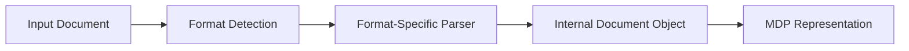

# Document Processing

This guide explains how Datapack processes documents, including supported formats, the processing pipeline, and best practices.

## Supported Document Formats

Datapack provides a unified API for working with various document formats. The core supported formats include:

| Format | Extension | Description | Requirements |
|--------|-----------|-------------|--------------|
| MDP | .mdp | Datapack's native format (Markdown + YAML metadata) | None (core) |
| Markdown | .md | Standard Markdown with optional frontmatter | None (core) |
| Plain Text | .txt | Simple text documents | None (core) |
| JSON | .json | Structured data in JSON format | None (core) |
| HTML | .html, .htm | Web documents | `pip install datapack[html]` |
| PDF | .pdf | Adobe PDF documents | `pip install datapack[pdf]` |
| Word | .docx | Microsoft Word documents | `pip install datapack[docx]` |
| CSV | .csv | Comma-separated values | None (core) |
| XML | .xml | Extensible Markup Language documents | None (core) |

## Document Processing Pipeline

The Datapack document processing pipeline consists of several key stages:

1. **Ingestion**: Converting the input document to the internal representation
2. **Parsing**: Extracting content and metadata
3. **Processing**: Applying transformations, extracting entities, etc.
4. **Enrichment**: Adding metadata, annotations, and context
5. **Output**: Converting the internal representation to the desired output format

### Ingestion Process



Different document formats are handled through specialized parsers that extract both content and metadata, which are then unified in Datapack's internal representation.

## Using the Document API

Here's how to work with different document formats using Datapack:

### Loading Documents

```python
from datapack import Document

# From MDP (native format)
doc = Document.from_file("document.mdp")

# From Markdown
md_doc = Document.from_file("document.md")

# From PDF (requires pdf extras)
pdf_doc = Document.from_file("document.pdf")

# From Word (requires docx extras)
word_doc = Document.from_file("document.docx")

# From HTML
html_doc = Document.from_file("document.html")

# From plain text
with open("document.txt", "r") as f:
    text = f.read()
    text_doc = Document.from_text(text)
```

### Converting Between Formats

```python
from datapack import Document

# Load a document
doc = Document.from_file("document.pdf")

# Convert to different formats
doc.to_markdown("document.md")
doc.to_html("document.html")
doc.to_mdp("document.mdp")  # Native format
doc.to_text("document.txt")
doc.to_json("document.json")
```

## Content Extraction

Datapack provides tools for extracting specific elements from documents:

```python
from datapack import Document

doc = Document.from_file("document.mdp")

# Extract headings
headings = doc.get_headings()
for heading in headings:
    print(f"Level {heading.level}: {heading.text}")

# Extract sections (heading + content)
sections = doc.get_sections()
for section in sections:
    print(f"Section: {section.title}")
    print(f"Content: {section.content[:100]}...")  # First 100 chars

# Extract specific elements
tables = doc.get_elements("table")
code_blocks = doc.get_elements("code")
images = doc.get_elements("image")
```

## Document Structure Analysis

Datapack can analyze the structure of documents to extract meaningful information:

```python
from datapack import Document, StructureAnalyzer

doc = Document.from_file("document.mdp")
analyzer = StructureAnalyzer()

# Analyze document structure
structure = analyzer.analyze(doc)

# Get document outline
outline = structure.outline
print(f"Document has {len(outline.sections)} top-level sections")

# Identify document type
doc_type = structure.document_type
print(f"Document appears to be a {doc_type}")

# Get content breakdown
breakdown = structure.content_breakdown
print(f"Text: {breakdown.text_percentage}%")
print(f"Code: {breakdown.code_percentage}%")
print(f"Tables: {breakdown.table_percentage}%")
```

## Batch Processing

For processing multiple documents, Datapack provides batch processing capabilities:

```python
from datapack import DocumentBatch, Document

# Create a batch from multiple files
batch = DocumentBatch.from_directory("./documents/", recursive=True)

# Process all documents
batch.process(lambda doc: doc.add_metadata(processed=True))

# Filter documents
pdf_docs = batch.filter(lambda doc: doc.source_format == "pdf")
large_docs = batch.filter(lambda doc: len(doc.content) > 10000)

# Save all processed documents
batch.save_all(output_dir="./processed/", format="mdp")
```

## Format-Specific Considerations

### PDF Processing

PDF processing requires the `pdf` extras and includes special handling for:

- Text extraction with layout preservation
- Embedded image extraction
- Table detection and extraction
- Form field detection

```python
from datapack import Document, PDFConfig

# Configure PDF processing options
pdf_config = PDFConfig(
    extract_images=True,
    detect_tables=True,
    ocr_enabled=False,  # Enable for scanned documents
    layout_analysis=True
)

# Process PDF with configuration
doc = Document.from_file("document.pdf", config=pdf_config)
```

### Markdown Processing

Markdown processing includes special handling for:

- Frontmatter extraction (YAML, TOML, or JSON)
- Markdown extension support (tables, footnotes, etc.)
- Code block language detection

```python
from datapack import Document, MarkdownConfig

# Configure Markdown processing
md_config = MarkdownConfig(
    extensions=["tables", "footnotes", "code_highlighting"],
    frontmatter=True
)

# Process Markdown with configuration
doc = Document.from_file("document.md", config=md_config)
```

## Best Practices

1. **Use MDP for Internal Storage**: Convert documents to the MDP format for internal storage and processing
2. **Preserve Original Files**: Keep original files for reference and validation
3. **Process in Batches**: Use batch processing for efficiency with large document sets
4. **Configure Format-Specific Options**: Use format-specific configuration for optimal results
5. **Handle Format Limitations**: Be aware of limitations when converting between formats
6. **Verify Output**: Always verify the output when converting between formats

## Next Steps

- Explore the [MDP Format](../mdp_format.md) to learn about Datapack's native document format
- See [Metadata & Annotations](metadata-annotations.md) to learn how to enrich documents
- Try practical examples in the [Document Processing Examples](../examples/basic/document-parsing.md) section 