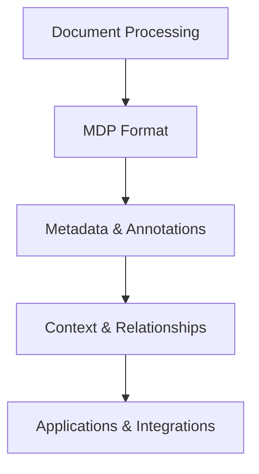

# Core Concepts Overview

This section introduces the fundamental concepts of Datapack, providing a comprehensive understanding of how the library works and how its components fit together.

## Key Concepts

Datapack is built around several core concepts that provide its functionality and flexibility:

1. **Document Processing** - How Datapack handles different document types and formats
2. **MDP Format** - The Markdown Data Package format that powers Datapack
3. **Metadata & Annotations** - How additional information and context are associated with documents
4. **Context & Relationships** - How documents connect to each other and maintain contextual information

## Document Processing

Datapack provides a unified approach to working with documents in different formats. It can ingest, process, and output documents in formats like Markdown, PDF, Word, HTML, and more.

[Learn more about Document Processing →](document-processing.md)

## MDP Format

The Markdown Data Package (MDP) format is at the heart of Datapack. It combines markdown content with YAML frontmatter for metadata, creating a flexible and powerful document representation format.

[Learn more about the MDP Format →](../mdp_format.md)

## Metadata & Annotations

Metadata adds structured information to documents, while annotations provide a way to mark up, classify, or add information to specific parts of a document's content.

[Learn more about Metadata & Annotations →](metadata-annotations.md)

## Context & Relationships

Datapack allows documents to exist as part of a connected ecosystem rather than as isolated entities, maintaining relationships between documents and preserving context.

[Learn more about Context & Relationships →](context-relationships.md)

## How These Concepts Work Together

These concepts don't exist in isolation—they work together to provide Datapack's capabilities:

- **Document Processing** provides the input/output capabilities
- **MDP Format** provides the storage and representation format
- **Metadata & Annotations** enrich documents with additional information
- **Context & Relationships** connect documents into a knowledge network
- **Applications & Integrations** leverage all these capabilities

## Where to Go Next

- Start with [Document Processing](document-processing.md) to understand how Datapack handles different document formats
- Explore the [MDP Format](../mdp_format.md) to learn about Datapack's native document format
- See [Metadata & Annotations](metadata-annotations.md) to learn how to enrich documents
- Check out [Context & Relationships](context-relationships.md) to understand document connections 