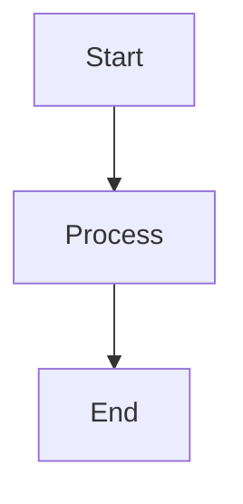

# The MDP Format

The Markdown Data Package (MDP) format is Datapack's native document format. It combines the readability and simplicity of Markdown with the structured metadata capabilities of YAML frontmatter, creating a powerful format for document representation.

## Overview

An MDP file consists of two main components:

1. **YAML Frontmatter**: Structured metadata at the beginning of the file
2. **Markdown Content**: The document's content in Markdown format

### Basic Structure

```markdown
---
title: Example Document
author: John Doe
version: 1.0.0
created_at: 2023-06-01
tags:
  - example
  - documentation
---

# Example Document

This is the content of the document written in Markdown.

## Section 1

This is a section with **formatting** and [links](https://example.com).
```

The frontmatter is enclosed between triple-dash (`---`) delimiters and contains YAML-formatted metadata. The content follows the frontmatter and is written in standard Markdown.

## Metadata in MDP

The frontmatter section of an MDP file can contain any valid YAML, allowing for rich and flexible metadata:

### Standard Metadata Fields

While you can include any metadata fields, Datapack recognizes certain standard fields:

| Field | Type | Description |
|-------|------|-------------|
| `title` | String | Document title |
| `author` | String | Document author |
| `created_at` | Date/String | Creation date |
| `updated_at` | Date/String | Last update date |
| `version` | String | Document version |
| `tags` | Array | List of tags |
| `description` | String | Brief description |
| `language` | String | Document language code |
| `status` | String | Document status (e.g., "draft", "published") |
| `license` | String | Document license |

### Complex Metadata

MDP supports complex nested metadata structures:

```yaml
---
title: Complex Metadata Example
author:
  name: John Doe
  email: john@example.com
  organization: Example Corp
versions:
  - number: 1.0.0
    date: 2023-05-01
    changes: Initial release
  - number: 1.1.0
    date: 2023-06-01
    changes: Bug fixes and improvements
references:
  primary:
    - title: Reference Document 1
      url: https://example.com/ref1
  secondary:
    - title: Reference Document 2
      url: https://example.com/ref2
---
```

## Content in MDP

The content section of an MDP file supports standard Markdown syntax, including:

- Headings (# to ######)
- Emphasis (bold, italic)
- Lists (ordered and unordered)
- Links
- Images
- Code blocks (inline and fenced)
- Blockquotes
- Tables
- Horizontal rules
- Footnotes (with extension support)

### Extended Markdown Support

Datapack's MDP format supports extended Markdown features through the CommonMark specification plus popular extensions:

- Tables
- Task lists
- Strikethrough
- Footnotes
- Definition lists
- Mathematics (LaTeX syntax)
- Diagrams (Mermaid, PlantUML)
- Syntax highlighting for code blocks

Example of extended Markdown features:

```markdown
## Math Example

The quadratic formula is $x = \frac{-b \pm \sqrt{b^2 - 4ac}}{2a}$

## Diagram Example



## Working with MDP Files

Datapack provides two APIs for working with MDP files: a user-friendly high-level API and a lower-level core API.

### Using the User-Friendly API (Recommended)

The enhanced user-friendly API provides intuitive classes for working with MDP files:

```python
from datapack.mdp import Document

# Create a document with content and metadata
doc = Document.create(
    title="Example Document",
    content="# Example\n\nThis is an example document.",
    author="John Doe",
    tags=["example", "documentation"]
)

# Access properties directly
print(doc.title)  # "Example Document"
print(doc.author)  # "John Doe"
print(doc.tags)  # ["example", "documentation"]

# Save as MDP
doc.save("example.mdp")

# Load from an MDP file
loaded_doc = Document.from_file("example.mdp")

# Modify properties
loaded_doc.title = "Updated Example"
loaded_doc.add_tag("updated")

# Save changes
loaded_doc.save()
```

Working with collections of documents:

```python
from datapack.mdp import Collection, Document

# Create a collection
collection = Collection("Example Collection")

# Add documents to the collection
doc1 = Document.create(title="First Document", content="# First Document")
doc2 = Document.create(title="Second Document", content="# Second Document")

collection.add_document(doc1)
collection.add_document(doc2)

# Create relationships between documents
doc1.add_relationship(doc2, relationship_type="related")

# Save all documents in the collection
collection.save_all("documents/")

# Load a collection from a directory
loaded_collection = Collection.from_directory("documents/")
```

For more examples and details, see [User-Friendly MDP API Examples](examples/mdp/user_friendly_api.md).

### Using the Core API

You can also work with MDP files using the lower-level core API:

```python
from datapack.mdp import create_metadata, write_mdp, read_mdp

# Create metadata and content
metadata = create_metadata(
    title="Example Document",
    author="John Doe",
    tags=["example", "documentation"]
)
content = "# Example\n\nThis is an example document."

# Write to an MDP file
mdp_file = write_mdp("example.mdp", metadata, content)

# Read from an MDP file
loaded = read_mdp("example.mdp")

# Access metadata and content
print(loaded.metadata["title"])  # "Example Document"
print(loaded.content)  # "# Example\n\nThis is an example document."
```

### Converting Files to MDP

Datapack provides utility functions for converting various file types to MDP format:

```python
from datapack.mdp import convert_file, convert_directory

# Convert a single file
doc = convert_file("document.txt", title="Converted Document")

# Convert all text and markdown files in a directory
docs = convert_directory(
    "source_documents/", 
    output_directory="converted_documents/",
    recursive=True
)

# Advanced conversion options
from datapack.mdp import extract_text_from_pdf, import_website

# Extract text from a PDF
pdf_doc = extract_text_from_pdf("document.pdf")

# Import content from a website
web_doc = import_website("https://example.com")
```

### Converting From MDP to Other Formats

```python
from datapack import Document

# Convert from MDP to another format
mdp_doc = Document.from_file("document.mdp")
mdp_doc.to_markdown("exported.md")
mdp_doc.to_html("exported.html")
```

## Annotations in MDP

Annotations in MDP files are stored in a special section of the frontmatter:

```yaml
---
title: Annotated Document
annotations:
  - id: ann1
    type: highlight
    start: 0
    end: 20
    metadata:
      color: yellow
      importance: high
  - id: ann2
    type: comment
    start: 30
    end: 50
    metadata:
      text: This needs revision
      author: John
---

# Annotated Document

This paragraph has a highlight annotation applied to it.

This paragraph has a comment annotation attached to it.
```

## Relationships in MDP

Document relationships are also stored in the frontmatter:

```yaml
---
title: Document with Relationships
relationships:
  - target: related_document.mdp
    type: references
    metadata:
      strength: strong
      description: Important reference
  - target: other_document.mdp
    type: extends
    metadata:
      description: Extension of concepts
---
```

## Benefits of the MDP Format

1. **Human-Readable**: Both metadata and content are in human-readable formats
2. **Version Control Friendly**: Text-based format works well with Git and other VCS
3. **Flexible Metadata**: YAML frontmatter supports complex metadata structures
4. **Familiar Syntax**: Uses widely-known Markdown for content
5. **Self-Contained**: Metadata and content in a single file
6. **Extensible**: Can be extended with additional features as needed

## Best Practices

1. **Consistent Metadata Schema**: Use a consistent schema for metadata across documents
2. **Validation**: Validate MDP files against a schema when appropriate
3. **Defaults**: Provide sensible defaults for missing metadata fields
4. **Escaping**: Properly escape special characters in both YAML and Markdown sections
5. **Unicode Support**: Use UTF-8 encoding for international characters

## MDP Format Specification

The MDP format follows these specifications:

- **Frontmatter**: YAML 1.2 specification
- **Content**: CommonMark specification with GFM extensions
- **File Encoding**: UTF-8
- **File Extension**: `.mdp`

## Next Steps

- Learn about [Document Processing](concepts/document-processing.md) to understand how to work with MDP files
- Explore [Metadata & Annotations](concepts/metadata-annotations.md) to see how to leverage the metadata capabilities
- See [Standard Metadata](examples/metadata/standard-metadata.md) for examples of common metadata patterns 